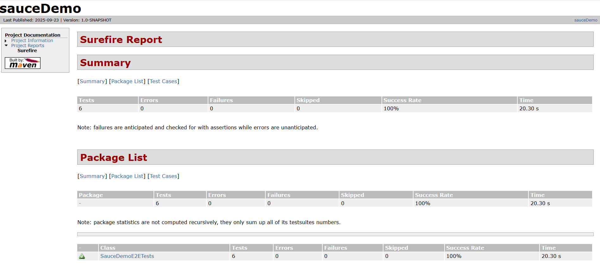
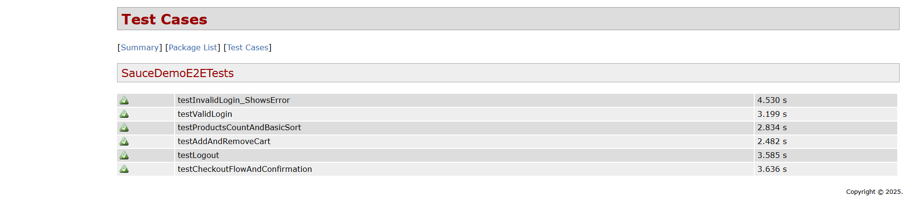

# SauceDemo E2E Manual and Automated Tests (Java + Selenium + JUnit 5 + Maven)
## 📝 Manual Test Cases

In addition to automated tests, this project includes **manual test cases** covering edge cases and scenarios not yet automated. These are located in the `/manual` directory.

Some examples include:
- Verifying product details display correctly
- Testing error handling on invalid form inputs

---

The end-to-end automated test cases for [saucedemo.com](https://www.saucedemo.com/) uses **Java 17, Selenium WebDriver, JUnit 5, and Maven**.

## ✅ Automation Test Cases Implemented
1. **Login**
    - `testValidLogin`: Verify valid login works.
    - `testInvalidLogin_ShowsError`: Verify invalid login shows error message.

2. **Products**
    - `testProductsCountAndBasicSort`: Verify products load and basic sorting works.

3. **Cart**
    - `testAddAndRemoveCart`: Verify adding and removing items from cart.

4. **Checkout**
    - `testCheckoutFlowAndConfirmation`: Verify checkout flow works through confirmation.

5. **Logout**
    - `testLogout`: Verify logout redirects to login page.

---

## 🛠️ How to Run Tests

```bash
# Cloning and running the tests
git clone https://github.com/japhethnamukuru/ecom-qa.git
cd ecom-qa
mvn clean verify site
```

```bash
# Clean, compile, run tests and generate reports
mvn clean verify site
```

## 📊 Reports

- **Surefire HTML Report**: `target/site/surefire-report.html`

Example report screenshots:




